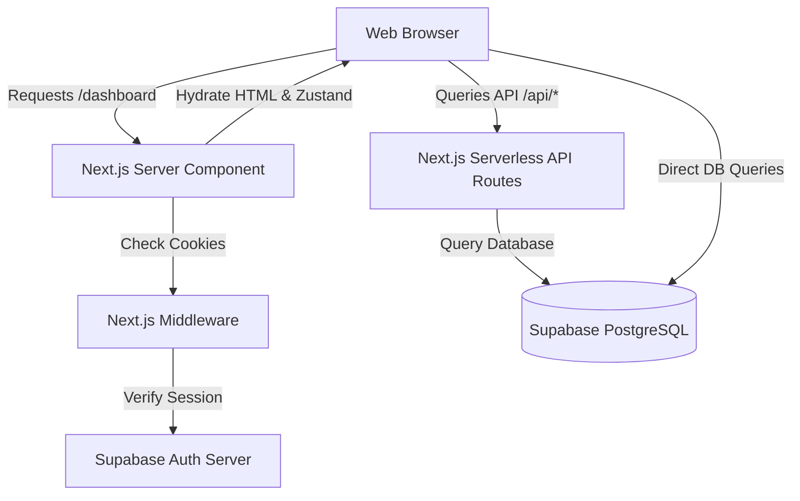

# 03 Architecture

## Tech Stack Overview
Karkhana is built as a highly responsive, modern web application:
* **Framework**: Next.js 14 (App Router)
* **Hosting**: Vercel (Serverless Edge & Lambda runtime)
* **Auth & DB**: Supabase (PostgreSQL with Row-Level Security, Auth, and Storage buckets)
* **Client State**: Zustand for global caching; React Query (TanStack Query) for API synchronization
* **UI styling**: Tailwind CSS and Framer Motion for micro-interactions

## Server/Client Split
Next.js 14's Server Components and Client Components are split strictly along performance and data security boundaries:
* **Server Components (`app/`)**: Handle static routes, layout shells, SEO metadata construction, and initially validate Supabase auth sessions before rendering HTML.
* **Client Components (`"use client"`)**: Handle highly interactive dashboards, modals, client-side input validations, visual charts, and direct database queries via the Supabase browser client.

## Global State Hydration (Zustand & React Query)
* **Zustand (`src/store/useStore.ts`)**: Caches critical session metadata (logged-in `user`, their active `organization` details, and branding themes) to avoid repeated database lookups.
* **React Query (`src/components/providers/QueryProvider.tsx`)**: Controls browser-side caching of transactional tables (DC lists, invoices, expense history) with automatic invalidation on update.
